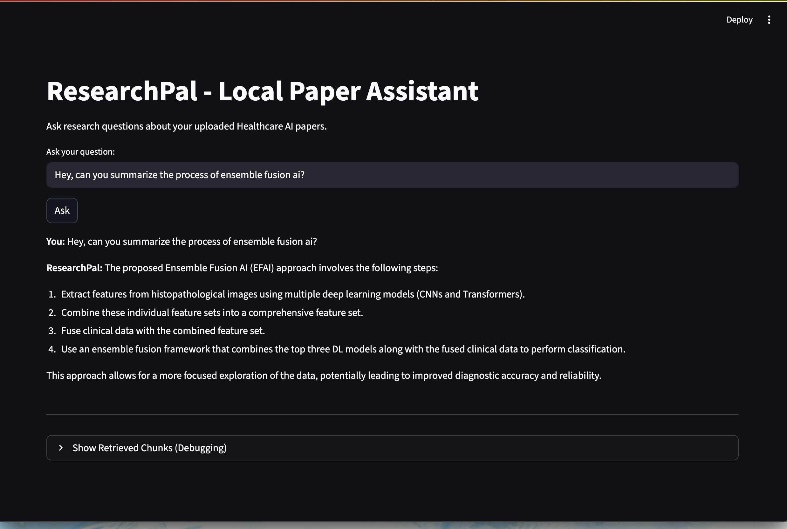

# 🧠 ResearchPal - Local RAG Research Paper Assistant 

---

## 📌 Overview
The **Research Paper Assistant** is a **local AI-powered chatbot** for literature/academic paper search and summarization.  
It leverages **Retrieval-Augmented Generation (RAG)** with **Ollama LLMs** and **ChromaDB** using  **LangChain** to deliver **accurate, private, and fast** answers from your uploaded PDFs.

---

## ✨ Features
- 📚 **PDF-based RAG** — Query your research papers directly.
- 🤖 **Runs Locally** — Uses Ollama, no internet required for inference.
- 🔍 **Semantic Search** — Embedding-powered document retrieval.
- 💬 **Interactive Chat** — Clean Streamlit interface.
- 🛡 **Data Privacy** — No data leaves your machine.
- **Two interfaces**:
  - 🖥 **Command-line mode** (`main.py`)
  - 🌐 **Streamlit web UI** (`streamlit_ui.py`)

---

## 🛠 Tech Stack
| Component         | Technology |
|------------------|------------|
| **LLM**          | [Ollama](https://ollama.ai) (llama3.2) |
| **Embeddings**   | [Ollama](https://ollama.ai) (mxbai-embed-large) |
| **Vector Store** | [ChromaDB](https://www.trychroma.com/) |
| **UI**           | [Streamlit](https://streamlit.io) |
| **Parsing**      | [UnstructuredPDFLoader](https://python.langchain.com/docs/integrations/document_loaders/unstructured_pdfloader/) |
| **Orchestration**| [LangChain](https://www.langchain.com/) |

---

## 📂 Project Structure

Research Paper Assistant/
│  
├── main.py # CLI interface for research Q&A  
├── streamlit_ui.py # Web UI using Streamlit  
├── vector.py # PDF ingestion, embeddings, and retriever logic  
├── requirements.txt # Python dependencies  
└── README.md  

## 🖼️ UI Preview

## 🧠 How It Works
PDF Parsing → Extracts text, splits into smaller chunks using UnstructuredPDFLoader from LangChain.

Embedding → Converts chunks into vectors using Ollama embeddings model (maxbai-embed-large).

Vector Storage → Saves embeddings into ChromaDB for retrieval.

Retriever Search → Finds top relevant chunks for a query.

RAG Prompting → Passes retrieved chunks + user question to LLaMA 3.2.

Answer Generation → Responds only with context from your papers.

## 📌 Future Improvements
- Multi-PDF summarization
- Improved retrieval ranking
- Export answers with citations
